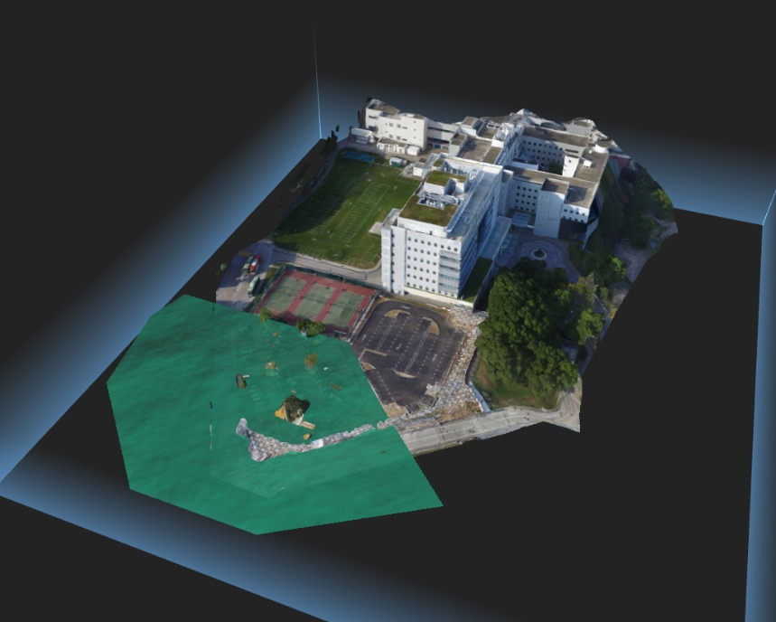

# Altizure SDK Offline

A simple demo to use Altizure offline without the online services.


## run

* set up a local host at the root of the folder.
    ```
    cd <path>/altizure-sdk-offline/
    python -m SimpleHTTPSERVER 8000
    ```
    * More information about hosting can be found on [3D SDK Quick Start](https://docs.altizure.cn/en/jssdk.html)


* visit `http://localhost:8000/index.html` through browser.

## files

We have provided an example data for your testing, you can download from pan.baidu.

Link: https://pan.baidu.com/s/1tEEbjO2aC2OviDCV5_fdhQ  Password: sjhw

You can view the data directly or change to your own data. Please follow the original folder structure if you use your own data.
```
project
│   README.md
│   index.html
│   crop_and_water.html
│
└───public
│   └───data
│       └───<PID_1>
│       │   │   apiinfo-<PID_1>.json
│       │   └───web
│       │       │   *.ab
│       │       │   *.ab
│       │       │   ...
│       │       │   info.txt
│       └───<PID_2>
│       │   │   apiinfo-<PID_2>.json
│       │   │   crop_mask_<PID_2>.json (if it has)
│       │   │   water_mask_<PID_2>.json (if it has)
│       │   └───web
│       │       │   *.ab
│       │       │   *.ab
│       │       │   ...
│       │       │   info.txt
│       │   ...
│   
└───assets
│   └───img
│       └───waternormals.jpg
│   
└───js
    │   altizure-all.min.js
    │   altizure.min.js
```


+ `index.html` is the landing webpage.
+ `public\data\<PID>\web` stores the altizure binary data of the 3D model. That's composed by a lot of `.ab` files and a `info.txt`
+ `public\data\<PID>\apiinfo-<PID>.json` stores the altizure graphql api `project(<PID>)` data.
+ `public\data\<PID>\crop_mask_<PID>.json` stores the altizure project crop data.
+ `public\data\<PID>\water_mask_<PID>.json` stores the altizure project water data.
+ `public\js\altizure.min.js` is the basic SDK, `public\js\altizure-all.min.js` is the SDK with all plugins.

## how to use your own data


* Store your `.ab` data files and `info.txt` in the path `public\data\<PID>\web\`.
* In `public\data\<PID>\apiinfo-<PID>.json`, change `<REPLACE_WITH_YOUR_HOSTNAME_PORT>` in `dataUrl` to your own hostname and port, like `localhost:8000`.
* The `apiinfo-<PID>.json` file can be downloaded from project overview page: https://www.altizure.cn/overview?pid=PID
* In `index.html` change your `apiinfo-<PID>.json` request path. If you totally follow the folder structure before, you will only need to change PID to your own.
* If you want to do crop or add water to project, please refer to `crop_and_water.html` demo. You need to download `crop_mask_<PID>.json` and `water_mask_<PID>.json` from project overview page, place them in `data\<PID>` and change `<PID>` in `crop_and_water.html` to your own.


* If you need to add multiple projects to your scene, you need to use different `apiinfo` for each project. Just request different `apiinfo-<PID>.json` files then add them to scene following the method in `index.html`.

## notice about hosting ab files

* If you host your ab files on nginx server, you may need to set `Allow-Cross-Origin` to enable visiting the data from different origins. Additionally, a correct error message `404` is required for ab files loading in sdk. 
* If you use host methods other than nginx, please make sure the two conditions are met: `enable cors`，`return 404 correctly`.
* You refer to [this article](https://serverfault.com/questions/393532/allowing-cross-origin-requests-cors-on-nginx-for-404-responses/700670) for configure nginx rightly.
* Here is a demo nginx config to allow cors and return `404` properly.
```
server {
    listen 8000;
    server_name 127.0.0.1:8000;
    location / {
        add_header 'Access-Control-Allow-Origin' '*' always;
        add_header 'Access-Control-Allow-Methods' 'GET,POST,DELETE' always;
        add_header 'Access-Control-Allow-Header' 'Content-Type,*' always;
	    root  /home/altizure/demo/data;
        index index.html index.htm;
    }

    error_page 404 /404.html;
        location = /40x.html {
    }

    error_page 500 502 503 504  /50x.html;
    location = /50x.html {
        root /usr/share/nginx/html;
    }
}
```